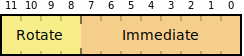

The [ARM instruction set][arm-ia] encodes immediate values in an unusual way. It's typical of the design of the processor architecture: elegant, pragmatic, and quirky. Despite only using 12 bits of instruction space, the immediate value can represent a useful set of 32-bit constants.

[arm-ia]: http://en.wikipedia.org/wiki/ARM_architecture#Instruction_set

## What?

Perhaps I should start with some background. [Machine code][machine-code] is what computer processors run on: [binary][binary] representations of simple instructions. All ARM processors (like [the one in your iPhone][apple-a7], or [the other dozen in various devices][arm7tdmi] around your home) have 16 basic data processing instructions.

[machine-code]: http://en.wikipedia.org/wiki/Machine_code
[binary]: http://en.wikipedia.org/wiki/Binary_number
[apple-a7]: http://en.wikipedia.org/wiki/Apple_A7
[arm7tdmi]: http://en.wikipedia.org/wiki/ARM7TDMI

Each data processing instruction can work with several combinations of operands. For example, here are three different `ADD` instructions:

```arm
ADD r0, r2, r3          ; r0 = r2 + r3
ADD r0, r2, r3, LSL #4  ; r0 = r2 + (r3 << 4)
ADD r0, r2, #&4F0000    ; r0 = r2 + 0x4F0000
```

The first is easy to understand: add two registers, and store in a third. The second example shows the use of the barrel shifter, which can shift or rotate the second operand before performing the operation. This allows for some fairly complex single-instruction operations, and more importantly lots of fun optimising your assembler code.

But the instruction I want to describe in more detail here is the third and simplest one: adding a register to a constant value. This value is encoded in the instruction, so that it's immediately available.

## Immediate value encoding

ARM, like other [RISC][risc] architectures [MIPS][mips] and [PowerPC][powerpc], has a fixed instruction size of 32 bits. This is a good design decision, and it makes instruction decode and pipeline management much easier than with the variable instruction size of [x86][x86] or [680x0][68k]. However, it means that any instruction with an immediate value operand cannot represent a full 32-bit number.

[risc]: http://en.wikipedia.org/wiki/Reduced_instruction_set_computing
[mips]: http://en.wikipedia.org/wiki/MIPS_architecture
[powerpc]: http://en.wikipedia.org/wiki/PowerPC
[x86]: http://en.wikipedia.org/wiki/X86
[68k]: http://en.wikipedia.org/wiki/Motorola_68000

Here's the bit layout of an ARM data processing instruction:


Any instruction with bits 27 and 26 as 00 is data processing. The four-bit opcode field in bits 24&ndash;21 defines exactly which instruction this is: add, subtract, move, compare, and so on. `0100` is `ADD`.

Bit 25 is the "immediate" bit. If it's 0, then operand 2 is a register. If it's set to 1, then operand 2 is an immediate value.

Note that operand 2 is only 12 bits. That doesn't give a huge range of numbers: 0&ndash;4095, or a byte and a half. Not great when you're mostly working with 32-bit numbers and addresses.

Compare it also to the equivalent instruction in MIPS, `addi`:


Or the similar PowerPC, also called `addi`:


Both have 16-bit immediate values: 0&ndash;65535, or two bytes. This is much more reasonable. Unfortunately, because of the 4-bit condition field in every ARM instruction, the immediate field has to be smaller. And therefore less useful.

## The clever part

But ARM doesn't use the 12-bit immediate value as a 12-bit number. Instead, it's an 8-bit number with a [4-bit rotation][rotation], like this:

[rotation]: http://en.wikipedia.org/wiki/Circular_shift



The 4-bit rotation value has 16 possible settings, so it's not possible to rotate the 8-bit value to any position in the 32-bit word. The most useful way to use this rotation value is to multiply it by two. It can then represent all even numbers from zero to 30.
     
To form the constant for the data processing instruction, the 8-bit immediate value is extended with zeroes to 32 bits, then rotated the specified number of places to the right. For some values of rotation, this can allow splitting the 8-bit value between bytes. See the table below for all possible rotations.


## Examples

The rotated byte encoding allows the 12-bit value to represent a much more useful set of numbers than just 0&ndash;4095. It's occasionally even more useful than the MIPS or PowerPC 16-bit immediate value.

ARM immediate values can represent any power of 2 from 0 to 31. So you can set, clear, or toggle any bit with one instruction:

```arm
ORR r5, r5, #&8000     ; Set bit 15 of r5
BIC r0, r0, #&20       ; ASCII lower-case to upper-case
EOR r9, r9, #&80000000 ; Toggle bit 31 of r9
```

More generally, you can specify a byte value at any of the four locations in the word:

```arm
AND r0, r0, #&ff000000 ; Only keep the top byte of r0
```

In practice, this encoding gives a lot of values that would not be available otherwise. Large loop termination values, bit selections and masks, and lots of other weird constants are all available.

But what I find really compelling is the inventiveness of the design. Faced with the constraint of only having 12 bits to use, the ARM designers had the insight to reuse the idle [barrel shifter][barrel-shifter] to allow a wide range of useful numbers. To my knowledge, no other architecture has this feature. It's unique.

[barrel-shifter]: http://en.wikipedia.org/wiki/Barrel_shifter
