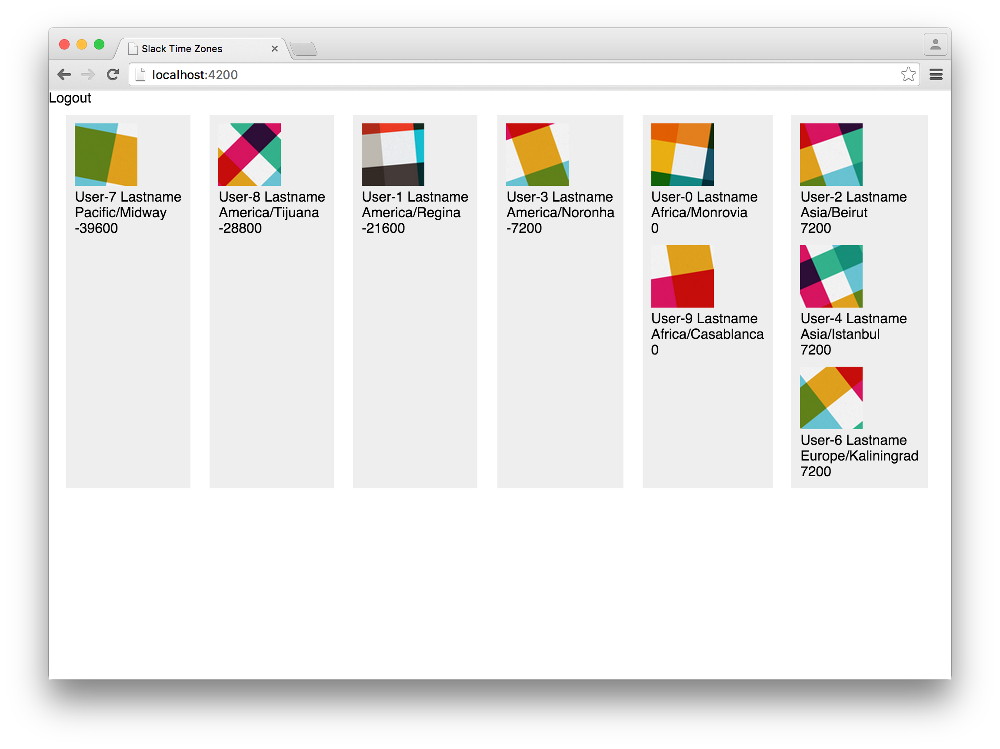
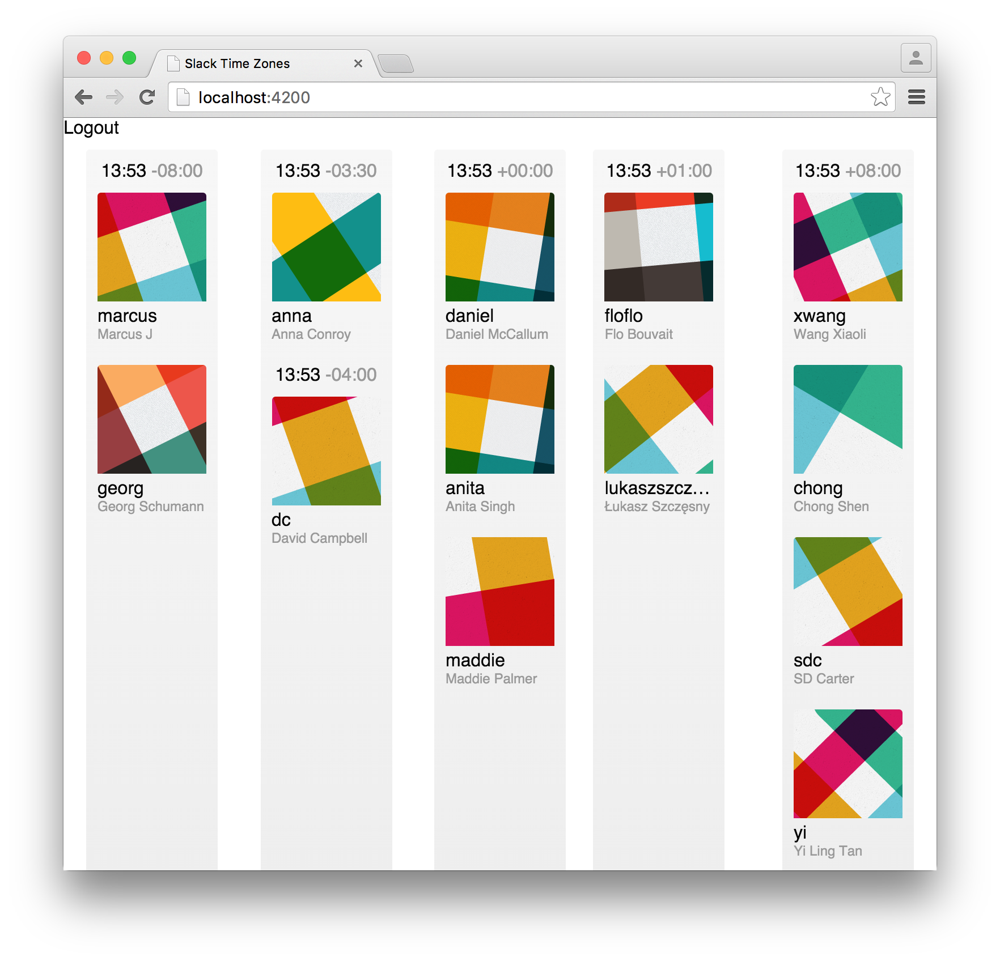

This is part three of a five part series on building [Team Time Zone][team-time-zone], an Ember app for keeping track of what time it is for all your Slack friends across the world.

[team-time-zone]: https://teamtime.zone/

Having [built out a test version of the Slack API, and an Ember Data adapter to access it][part-2], the next step was to take the user information and present it. I had a pretty solid idea of how to go about this, but I just couldn't get started.

This often happens to me when I'm working on projects. I get stuck right at the beginning, worrying about getting the implementation badly wrong and having to throw it all away. I spend a long time trying to get the design right, and the longer I try to hold it all in my head, the less certain I get that it even makes sense.

Sometimes the only way to write good code is to write bad code, and then fix it. [Make a mess, and clean it up][make-a-mess-clean-it-up].

[make-a-mess-clean-it-up]: http://www.folklore.org/StoryView.py?story=Make_a_Mess,_Clean_it_Up!.txt

## Making a mess

Once you're experienced enough to have an opinion on what bad code is, purposefully writing bad code can be difficult. I find it's best to make it self-consciously awful, riddled with FIXMEs, avoiding abstractions. To give you an example of what I mean, here's the template code for my first version of the Team Time Zone UI:

```handlebars
{{#each columns as |column|}}
  <!-- FIXME: column should be a component -->
  <div class="timezone-column {{if column.empty 'timezone-column--empty'}}">
    <!-- FIXME: users should be grouped by timezone (asc) -->
    <!-- FIXME: timezone should be displayed -->
    <!-- FIXME: current time should be displayed -->
    <!-- FIXME: item should be a component -->
    {{#each column.users as |user|}}
      <div class="timezone-column__item">
        <div></div>
        <div>{{user.realName}}</div>
        <div>{{user.tz}}</div>
        <div>{{user.tzOffset}}</div>
      </div>
    {{/each}}
  </div>
{{/each}}
```

Nothing about this is any good at all. For one thing, it doesn't even work properly. But it's not as bad as the component code. [Look at this beautiful mess][mega-component]:

[mega-component]: https://github.com/alisdair/team-time-zone/commit/7b7b9bc247a8c56faf9edca63bcd90e1c1eaee9a

```javascript
import Ember from 'ember';
import TimezoneColumn from 'stz/models/timezone-column';

const secondsInHour = 3600;

function calculateTimezoneStart(offset) {
  return Math.floor(offset / secondsInHour) * secondsInHour;
}

function calculateTimezoneStop(offset) {
  return Math.ceil(offset / secondsInHour) * secondsInHour;
}

function nextTimezone(start) {
  return start + secondsInHour;
}

export default Ember.Component.extend({
  classNames: ['timezone-container'],

  users: Ember.computed.alias('model'),
  offsets: Ember.computed.mapBy('users', 'tzOffset'),
  earliest: Ember.computed.min('offsets'),
  latest: Ember.computed.max('offsets'),

  columns: Ember.computed('users.@each.tzOffset', function() {
    let users = this.get('model');
    let start = calculateTimezoneStart(this.get('earliest'));
    let stop = calculateTimezoneStop(this.get('latest'));
    let columns = Ember.A();

    for (let tz = start; tz < stop; tz = nextTimezone(tz)) {
      let matches = users.filter(function(user) {
        let offset = user.get('tzOffset');
        return offset >= tz && offset < nextTimezone(tz);
      });
      columns.push(TimezoneColumn.create({
        timezoneStart: tz,
        users: matches
      }));
    }

    return columns;
  })
});
```

Let's start with some [slightly broken functions for calculating offsets][off-by-one]. Add a `for` loop with questionable termination conditions that are unclear at best. And we're creating a function inside that loop! Really confusing and inefficient use of `Array.prototype.filter`. No composition, no breakdown of responsibilities, barely any data model. I wrote this less than two months ago, and now I couldn't tell you exactly what it does.

[off-by-one]: https://github.com/alisdair/team-time-zone/commit/6e293d074a03f95834a68de6e44a1b35046a1df8

But there are good things here too! Specifically, I've understood how to solve the problem, or at least how to get close. I've come up with some good names for concepts within the system.

Also, it does sort of work! Here's a screenshot to prove it:



## Clean it up

There's an important reason for making this mess. It gave me a concrete place to start building things properly. I can look at my program in a (sort-of) working state, and see the next small step to make it better, both functionally and qualitatively.

In this case, I started to break down the ridiculous mega component into smaller ones. The first design I had was a simple hierarchy of components:

- At the top, there's a timezone collection (for want of a better name)
- It renders timezone columns, one per hour, from earliest to latest
- Each column renders user profiles for all users in the timezone

### Aside: I really don't like time zones

There's a problem with this, which is that [time zones are awful][time-zones-computerphile]. For some hours of the clock, there are multiple time zones. And some of those have offsets which are partial hours. I have a coworker who lives in [Newfoundland, which has its own special UTC-3:30 timezone][newfoundland-time].

[time-zones-computerphile]: https://www.youtube.com/watch?v=-5wpm-gesOY
[newfoundland-time]: https://en.wikipedia.org/wiki/Newfoundland_Time_Zone

### Component hierarchy

Because there are multiple different times within one hour, we should group people in those time zones together. That means one more component, giving us the final hierarchy:

1. Collection
2. Column
3. Group
4. User

I already had most of these in the one giant component, so the direction of my work was clear: repeatedly split up the components into smaller ones, writing tests and fixing bugs as I went.

I'm fairly happy with how this went. I was able to [extract testable pure functions into util files][util-functions], where they could [be easily unit tested][util-test] (and corrected, when I found off-by-one errors). I wrote components which basically had the responsibility of splitting their input up by time zone value, which could also be unit tested. And finally there were the components that implemented the UI, [which were a perfect candidate for component integration testing][ember-component-integration-tests].

[util-functions]: https://github.com/alisdair/team-time-zone/blob/master/app/utils/timezone.js
[util-test]: https://github.com/alisdair/team-time-zone/blob/master/tests/unit/utils/timezone-test.js
[ember-component-integration-tests]: /ember-component-integration-tests/

The template hierarchy in particular is quite pleasing to look at. Here's the top level template on the route:

```handlebars
{{timezone-collection users=filteredUsers}}
```

Here's the timezone-collection template:

```handlebars
{{#each columns as |column|}}
  {{timezone-column users=column.users}}
{{/each}}
```

And timezone-column:

```handlebars
{{#each groups as |group|}}
  {{timezone-group
    timezoneOffset=group.timezoneOffset
    users=group.users}}
{{/each}}
```

Then timezone-group:

```handlebars
<div class="timezone-group__time clickable" {{action 'toggleTimeFormat'}}>
  {{time}}
</div>

<div class="timezone-group__timezone">{{timezone}}</div>

{{#each sortedUsers as |user|}}
  {{user-profile user=user}}
{{/each}}
```

And finally, user-profile:

```handlebars
<div class="user-profile__avatar" title={{user.realName}}>
  
</div>
<div class="user-profile__username" title={{user.name}}>
  {{user.name}}
</div>
<div class="user-profile__realname" title={{user.realName}}>
  {{user.realName}}
</div>
```

What I like so much about this is that there's barely any nesting. Only one loop per template, only a few lines each. Even the most complex template, the user profile, is easy to understand with only a minute of looking at it.

From a functionality point of view, this brought me to a pretty good spot. Not everything worked yet, but the basics were definitely there. Here's a screenshot:



## Finishing and polishing

With a few more commits, I added the last missing features needed to make the app good enough to ship. [Displaying the real local time for each group][display-time] was the entire point of the app, so that came first. It was really simple: just use the awesome [moment.js library][momentjs] to calculate the offset local time.

Once that worked, I [added a timer to update the clock every second][update-time]. Then almost everything else remaining was UI polish: adding navigation, fixing a few styles at mobile widths, adding this cute loading spinner:

<div class="loading-spinner">
<div class="loading-spinner__text">Loading, please wait</div>
<div class="loading-spinner__square"></div>
<div class="loading-spinner__square"></div>
<div class="loading-spinner__square"></div>
<div class="loading-spinner__square"></div>
</div>

[display-time]: https://github.com/alisdair/team-time-zone/commit/4d16a3be0b3b5aafc384a00c14f157e6c9e980a1
[update-time]: https://github.com/alisdair/team-time-zone/commit/beeb6fd5b759ce1ad3fcb393ff0ee758fa2cbaf5
[momentjs]: http://momentjs.com

After a few more evenings of playing with CSS gradients and animations, I eventually ran out of things to do. The UI worked, my code was well designed, I had great test coverage.

There was nothing else for it. Time to bite the bullet and try to implement authentication.

---

This article is part three of a five-part series on building Team Time Zone:

1. [Inception, Prototype, and Planning][part-1]
2. [Ember Data and the Slack API][part-2]
3. [Creating the User Interface][part-3]
4. Authenticating with Slack
5. Deployment, Release, and Future

[part-1]: /building-team-time-zone-inception-prototype-and-planning/
[part-2]: /building-team-time-zone-ember-data-and-the-slack-api/
[part-3]: /building-team-time-zone-creating-the-user-interface/

[Follow me on Twitter][twitter] or [subscribe to the RSS feed][feed] to catch the next article!

[twitter]: https://twitter.com/alisdair
[feed]: /feed.rss
