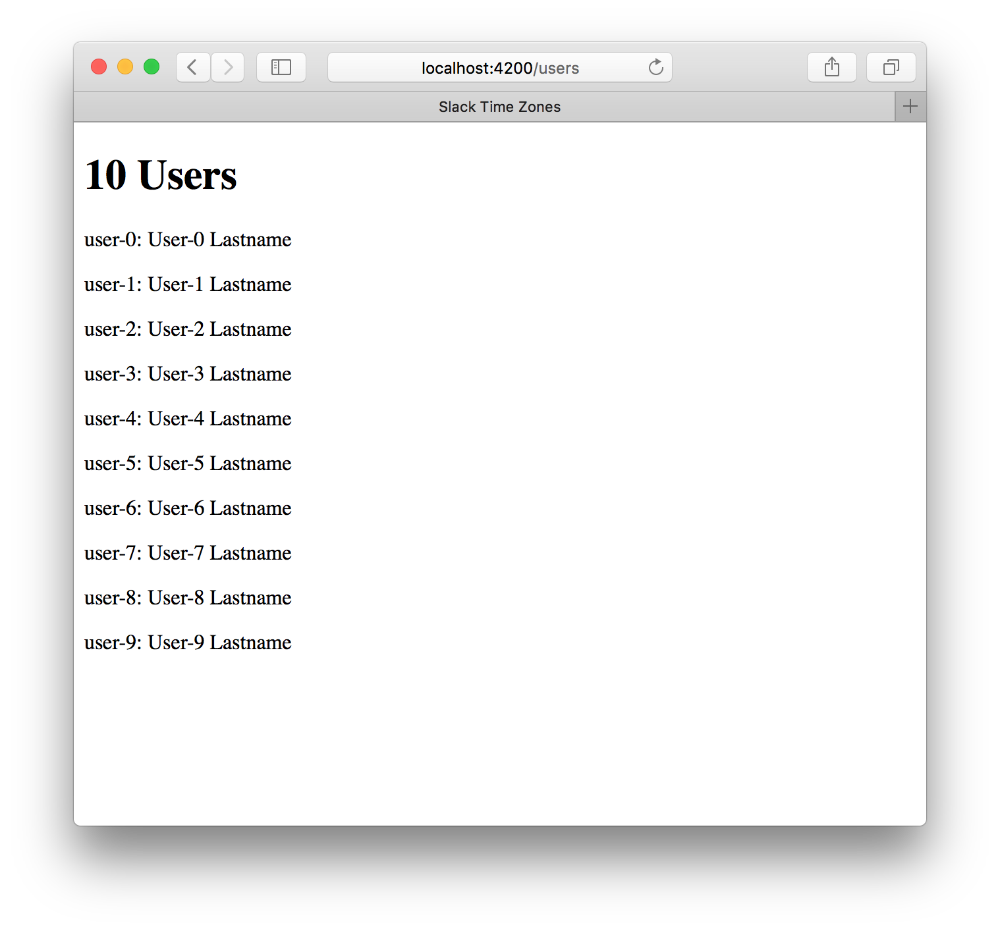

This is part two of a five part series on building [Team Time Zone][team-time-zone], a tool for helping distributed teams with the challenges of clocks and scheduling across multiple continents.

[team-time-zone]: https://teamtime.zone/

After [some initial prototyping and planning][inception], the next step was integrating the Slack API with Ember Data. I wanted to be able to fetch a list of users, load them into my local data store, and use the data to start building my user interface code. I wanted to tackle the login part last, so this assumed that authentication was solved.

[inception]: /building-team-time-zone-inception-planning-and-prototyping/

Ember's testing story is really great. There are incredible tools provided by the community for development and test against JSON APIs. So I decided to build my Ember Data adapter code test-first, without even trying to hit the Slack API itself at all.

## Mirage: building an Ember app without an API

[ember-cli-mirage][mirage] is one of the most important tools in my Ember testing workflow. It is a huge time saver. It was vital to building Team Time Zone.

[mirage]: http://www.ember-cli-mirage.com

Mirage works by intercepting AJAX requests from your Ember app in development and test mode. When you're building an app where the API isn't ready yet, you can write out a really simple stub with Mirage, and get on with the rest of your work. Then when the API team finishes their work, just turn off Mirage and hook up to your real data source.

Building a mock API in Mirage is really simple. Here's the first simple Mirage config I wrote:

```javascript
import Ember from 'ember';

export default function() {
  this.get('/slack/users.list', function(db, request) {
    if (Ember.isNone(request.params.token)) {
      return { ok: false, error: 'not_authed' };
    }

    if (request.params.token === 'invalid') {
      return { ok: false, error: 'invalid_auth' };
    }

    return { ok: true, members: db.users };
  });
}
```

The call to `get` describes the URL of the API endpoint, in this case `/slack/users.list`. This maps to Slack's `users.list` API endpoint.

For now, the body of this API call is really simple. It does one of three things:

1. If no API token is supplied in the request params, it returns the standard Slack `not_authed` error message;
2. If the API token is some test "invalid" value, it returns the `invalid_auth` error;
3. Otherwise, it returns an `ok` response, sending all of the users in my database in the body.

### A fake API needs a fake database

You might be thinking "*users in my database? what database?*". That would be a reasonable question.

What distinguishes Mirage from other API mocking tools like Pretender is its simple in-memory JSON object store. This is just a list of data types, each with a tiny REST-like API overlaid on top of it, allowing you to `find`, `insert`, `update`, and `delete` them.

But how do we get useful data into the Mirage database? In development mode, this is normally done with a fixed *scenario*: a JavaScript file which builds and inserts a set number of records for each of your API data stores. In test mode, you can create different scenarios for different acceptance tests, by building only the data you need to test with.

These scenarios use *factories*, which are Mirage constructs for building data records based on default values. For this app, I defined a simple `user` factory, which allows me to create a number of user records to send back over the API.

Here's a shorter version of what the user factory looks like:

```javascript
import Mirage from 'ember-cli-mirage';

export default Mirage.Factory.extend({
  id: i => `U${2000 + i}BEGCF`,
  name: i => `user-${i}`,
  tz: 'Europe/London',
  tz_label: 'London',
  tz_offset: 0,
  profile(i) {
    let first_name = `User-${i}`;
    return {
      first_name,
      last_name: 'Lastname',
      real_name: `${first_name} Lastname`,
      real_name_normalized: `${first_name} Lastname`,
    };
  },
});
```

The implementation of a factory is just an object with a number of properties, which roughly maps to a list of columns in your SQL database, or fields on your JSON API response body. Each property can either be a normal value (e.g. `tz` in my factory defaults to `'Europe/London'`), or a function.

If the property is a function, it's called at build time with an auto-incrementing integer parameter. This allows you to build a number of users with different data. In the case of the user factory above, to build a number of users I can write:

```javascript
server.createList('user', 3);
```

This will build users with names `user-0`, `user-1`, and `user-2`.

Each property can be overridden as necessary. So if I wanted a user with a particularly long name, I could write

```javascript
server.create('user', { name: 'Jill Long-name-for-testing-word-breaks' })
```

## Writing a custom Ember Data adapter

Now that I have my fake Slack API implementation, I want to start using it. But as [I mentioned in the previous post][inception], the API responses Slack sends aren't immediately compatible with Ember Data's defaults.

No problem! I can write an adapter to fix that up. So that's what I did next.

Building your own Ember Data adapter sounds like serious work, but it's actually really not too bad at all. There are a number of built-in adapters that do a lot of ground work for you, which you can either extend directly, or take inspiration from.

In the case of Slack, the API is so far away from Ember Data's norms that I ended up writing a subclass of the abstract `DS.Adapter` class. But I took a lot of design and implementation notes from reading the `DS.RESTAdapter` and `DS.ActiveModelAdapter` classes, which solve a lot of common problems.

The secret of building your own Ember Data adapter is that you only need to implement the methods you want to use in your app. While there are tons of methods for finding, querying, creating, updating, and deleting records, if all you do for now is fetch one endpoint, you just need to implement the code to make that work.

So I started by writing an implementation of `find` and `findAll`, which was all I needed for my app.

## Test driven development isn't all or nothing

Until recently, I thought that test driven development was a simple but fixed method for building software. First you write a failing test, then you write some code to make it pass, then you rework and improve either the code, or the test, or both. Also known as red, green, refactor. Repeat until the job is done.

The ordering is important. If you don't write a test first, you're doing it wrong and are a bad person. You must write the test first. The test drives your development! Right?

Well, the problem with this way of thinking is that often it isn't particularly useful to write a failing test. In fact, it can be really difficult to write a useful failing test for a module which conforms to an externally-defined interface. Like `DS.Adapter`.

Let's say I want to implement the most useful method in the adapter first: `findAll`. The signature for this method is simple enough:

```javascript
findAll: function(store, type) {
  // return a promise which resolves to an array of records
}
```

So how do you write a failing test for this? Let's assume we want to skip the silly circles of writing a test for a method that doesn't exist, seeing the exception, then writing an empty function, and so on. What's the first test that is going to be useful?

We might write something like this:

```javascript
test('findAll returns a promise', function() {
  let adapter = this.subject();

  let result = adapter.findAll({}, 'user');
  assert.equal(typeof result.then, 'function', 'returns a promise');
});
```

Okay! So how do we make this pass? The simplest way is this:

```javascript
findAll: function(store, type) {
  return { then: function() {} };
}
```

Great, the test passes! But we've learned absolutely nothing about our module, or how to implement the function, or how we're going to design the software. And this is a completely useless test, except perhaps to document the `DS.Adapter` interface, which is already documented elsewhere.

So when I do test driven development, I don't follow red-green-refactor religiously, and if you don't find it useful, I don't think you should either.

## Test driven doesn't mean test first

Test driven development isn't really about test coverage, or even decreasing code defects. It's about improving the design of your software. Here's how I go about using tests to improve design.

When I wrote this little adapter, I didn't write the test for `findAll` first. Instead, I wrote an implementation that didn't do any real work. Here's what the code looked like:

```javascript
findAll: function(store, type) {
  let url = this.buildURL(type.modelName, '.list');

  return this.ajax(url, 'GET');
},
```

This was the first code I wrote, I didn't write a test beforehand, and yet it works perfectly. I've never needed to change it.

It works because all it does is delegate its responsibility to two other methods, which are doing much more complex tasks. Once I'd written these two lines of code, I was sure it was the right approach for this method, so I wrote a test. The test used a mock for the (unwritten) `ajax` method, but depended on the implementation of `buildURL`. Here it is:

```javascript
test('findAll with mocked ajax method', function(assert) {
  assert.expect(3);

  let adapter = this.subject();
  adapter.ajax = function(url, type) {
    assert.equal(url, '/slack/users.list');
    assert.equal(type, 'GET');
  };

  adapter.findAll({}, user);
});
```

This test fails, but I only knew how to write it because I'd already designed and written my method. So it's not test-first, it's not red-green-refactor, but it is test driven development. Or at least it's my version of it.

To make this test fail, I need to implement `buildURL`. And now is the point at which I fall back into the normal testing loop. In this case, I wanted the test to pass as quickly as possible, so I wrote a really simple stub implementation of `buildURL`:

```javascript
buildURL: function(modelName, suffix) {
  return '/' + modelName + 's' + suffix;
}
```

I knew when I wrote it that this was not what [the real method would look like][buildURL], but it let my test pass for now. And having done this, I had a clear direction to go in: I needed to write `buildURL` properly, and then I needed to implement and test `ajax`.

[buildURL]: https://github.com/alisdair/team-time-zone/blob/master/app/adapters/slack.js#L26-L46

This is where this approach to test driven development works so well. You can write some code, write a test (with some mocks if necessary), see how to implement the other parts of your system, and then repeat. There's no point in writing trivial tests for simple, obvious pieces of glue code, but there's a huge benefit to writing tests for functions or modules with clear responsibilites and non-zero complexity.

As long as the code ends up well designed and with great test coverage, it doesn't matter if you write a test first, or in the middle, or at the end, or not at all. In some cases it's easier to arrive at a good design by writing tests near the start, but sometimes the tests just get in the way. Do whatever works.

## Read other people's code, understand it, reuse it

To build out my adapter's `buildURL` and `ajax` methods, I started by reading the implementations in the DS.RESTAdapter source. These didn't exactly fit what I needed, but there's no reason to solve similar problems completely independently. I would never have arrived at the short, neat implementation of `ajax` on my own. I saved a lot of time by basing my implementation on existing, well-written code.

The same goes for `buildURL`. There are some quirks with Slack's URL schema, but it's not all that different from what Ember Data expects. Compare [the source of my method][buildURL] with [the implementation from Ember Data's source code][ds-buildURL] and you'll see more similarities than differences.

[ds-buildURL]: https://github.com/emberjs/data/blob/v1.13.7/packages/ember-data/lib/adapters/build-url-mixin.js#L90-L110

Still, it's really important not to fall into the trap of copying and pasting code without understanding it. To make sure I understood what buildURL did and why, I was careful to write enough tests to cover all of the conditions in the code. This itself was really useful for my other Ember work, as now I know much more about how the `RESTAdapter` constructs URLs than I did before.

## Hooking everything up

Once I'd written the adapter, and built out a ton of unit tests for the `ajax` method, I built [a tiny Ember Data serializer][serializer] to cope with Slack's JSON response quirks. In this case, it was so simple that I didn't feel the need to write any tests at this point. It would be covered by integration tests later.

[serializer]: https://github.com/alisdair/team-time-zone/blob/418c71b17b3f98269f5c167a1f7084cdec96e65b/app/serializers/slack.js

With that done, it was time to connect all the parts and see if it worked. [In one fairly small commit][first-boot], I added a very simple user model, route, and template. All this does is create 10 test users with Mirage, load all of them in the route, and display their usernames and real names in a list on an empty page. Not very ambitious.

[first-boot]: https://github.com/alisdair/team-time-zone/commit/170a4ec4aa374e40f1632d4fd4570e6bfd547b61

But it worked!



This was a significant first step. I now had a simple Ember Data stack which worked with the Slack API, along with a simple local implementation of the API for testing and development work.  There was plenty of refactoring and polishing to do, but for now I was ready to move on to the exciting stuff: building the user interface.
