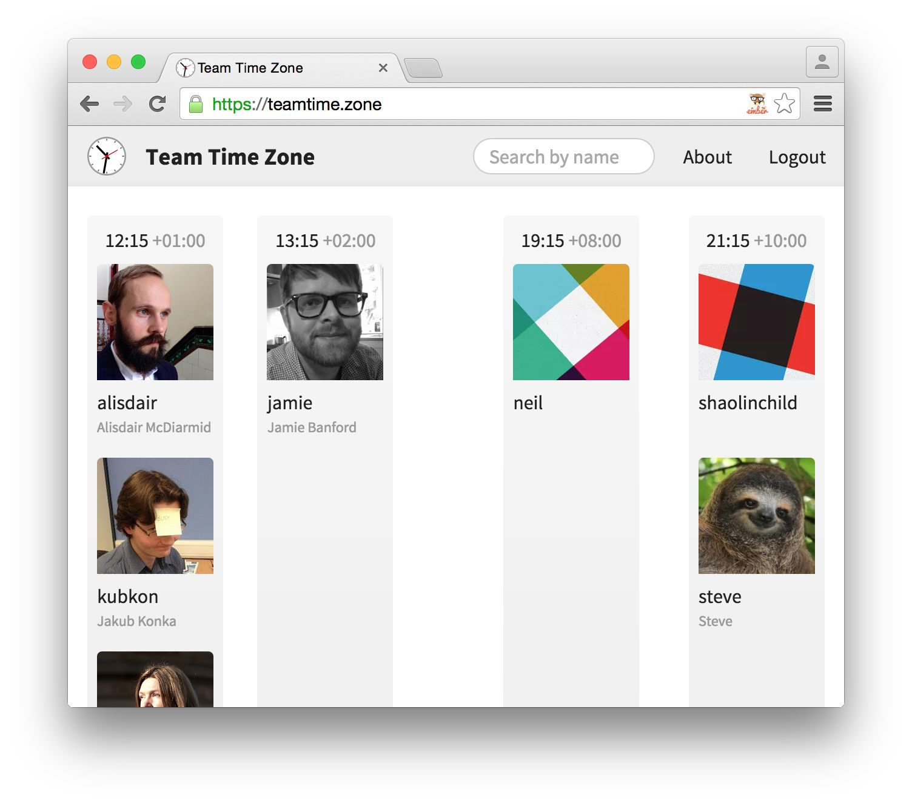
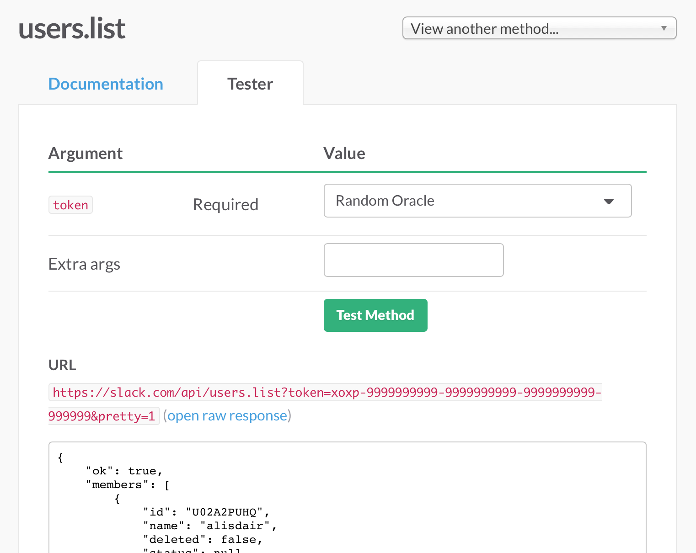
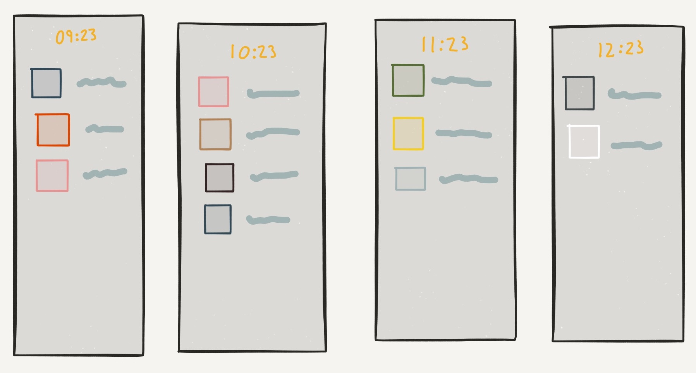
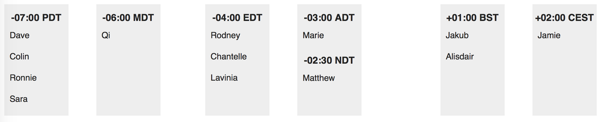

[I work at a company with a fully remote team][customerio-remote], distributed across at least 9 time zones. And some of my co-workers are always travelling, every month in a new state, country, or continent. It's really hard keeping up with it all.

[customerio-remote]: http://customer.io/blog/Lessons-from-becoming-a-remote-team.html

So I decided to build [Team Time Zone][teamtime.zone]. It's a tiny Ember app which hooks up to the Slack API and displays a wall of clocks for each time zone, with smiling avatars grouped underneath.



[teamtime.zone]: https://teamtime.zone/

When I first came up with the idea, it seemed like it might take a couple of weekends at the outside. It ended up taking more than a month of evenings & weekends, but it was worth the effort. I learned a ton, and now I never have to try to do arithmetic to work out how long it is until Portland wakes up.

## Inception

The germ of the idea was simple. I wanted a way to find out what time it was for everyone on the team, without having to keep track myself of where they were in the world. So I tried to think of what data sources there might be, and [Slack] came to mind. Everyone on the team is an avid user (especially of the new emoji reactions feature), so it was safe to assume that they'd keep their avatars and time zones up to date.

[slack]: https://www.slack.com/

I knew [Slack had an API][slack-api], so I quickly checked that the time zones were available. And they were, although [the web API looked a little unusual][slack-web-api]. So now the only remaining problems seemed manageable: authenticate with the API, hook its data up to Ember, and build the UI on top.

[slack-api]: https://api.slack.com/
[slack-web-api]: https://api.slack.com/web

These three tasks seemed fairly independent of each other, but I wanted to be sure that the project would work before diving into a real implementation. The first step was to investigate the hardest problem, authentication.

## Using OAuth2 to authenticate web apps

[Slack's API supports OAuth 2][slack-oauth], which is a fairly common standard, and is also used by GitHub, Google, Facebook, and many others. I expected this to be good news. Unfortunately, [OAuth2 is a massive specification][oauth2], and even with good documentation it's difficult to understand.

[slack-oauth]: https://api.slack.com/docs/oauth
[oauth2]: http://tools.ietf.org/html/draft-ietf-oauth-v2-31

OAuth2 solves the untrusted authentication problem. As a user, you want to be able to give limited access to your Slack account to third-party service providers. As a service provider, I want to access as little of your Slack account as possible, and I certainly don't want your password. So we go through a multi stage protocol to establish a secret token, which can then be used to authenticate and authorise requests to the API.

There are seven (!) steps to the protocol:

1. You click the login button in my web app, which opens a pop-up window with a URL pointing at the Slack server. This URL includes some unique information about your session (the "state" variable), as well as a public identifier for my app so that Slack can verify that it's registered with them.

2. Slack displays a quick login screen for you, if you're not already logged in with your browser. Then it verifies that you want to allow access to my app, and describes what permissions I'm requesting.

3. If you accept, you click a green button, and Slack redirects back to my application with a new session authentication code, a list of permissions granted, and that same "state" variable that I sent earlier.

4. My app sends the session authentication code to my back-end server, which combines it with both the public identifier and a secret key for my app, and sends it to the Slack servers.

5. Slack servers verify that the public and secret keys match, and that the authentication code is valid, and issues an API token back to my server.

6. My back-end server forwards the API token to the web application, which informs you that you logged in. Hooray!

7. The web application can now request data directly from the Slack API using this token.

Incredible, right? A huge amount of work just to get a token. But all of these steps are required if the system is to be secure to man-in-the-middle attacks, token reuse, and API abuse.

This way, no-one can impersonate my application to request authentication codes, because the secret is only on my production server. If my app suddenly goes rogue, Slack can shut down all the tokens. And at no point does the app have any more access to your Slack account than the permissions you grant it.

After a couple of hours of research, I felt like I understood how Slack's OAuth 2 web flow worked. It seemed manageable, but I wasn't thrilled that I was going to need to build an authentication server. I had hoped that my [Ember app could be served directly from a CDN][ember-deploy-s3-index], and use Slack as its only API and data source.

[ember-deploy-s3-index]: https://github.com/Kerry350/ember-deploy-s3-index

Unfortunately there's really no responsible way around this if OAuth2 is how you need to authenticate. But the server is really simple to implement, so I shrugged and decided it was no big deal.

A quick survey of the Ember authentication landscape revealed [the awesome torii project][torii], which handles steps 1&ndash;3 above, with really nice handling of the pop-up. All I'd need to do is customise it a little for Slack, write the back-end app and authorizer calls, and verify that it works.

[torii]: https://github.com/Vestorly/torii

Since that all sounded incredibly dull, I decided to leave it for the end, and began planning the more interesting parts: getting data from the API, and building out the user interface.

## Using the Slack API with Ember

To build the app, I only needed a small amount of data from Slack. I needed a list of users, their usernames or real names, an avatar, and a timezone value of some sort. [Slack's API docs list all their available data sources][slack-methods], and [one is called "users.list"][users-list], which sounded about right.

[slack-methods]: https://api.slack.com/methods
[users-list]: https://api.slack.com/methods/users.list

The user's time zone information was worryingly missing from the sample response in the docs. But Slack's API has [a neat little test form][slack-api-test], where you could use your developer API key to fetch data from your account over the API. This gave me back a result which looked pretty good, and included the time zone information. Great!

[slack-api-test]: https://api.slack.com/methods/users.list/test



 Here's what the JSON looks like, with some irrelevant personal data removed:

```json
{
  "ok": true,
  "members": [
    {
      "id": "U02A2PUHQ",
      "name": "alisdair",
      "real_name": "Alisdair McDiarmid",
      "tz": "Europe/London",
      "tz_label": "British Summer Time",
      "tz_offset": 3600,
      "profile": {
        "first_name": "Alisdair",
        "last_name": "McDiarmid",
        "real_name": "Alisdair McDiarmid",
        "real_name_normalized": "Alisdair McDiarmid",
        "image_32": "https://secure.gravatar.com/avatar/....jpg?s=32",
        "image_48": "https://secure.gravatar.com/avatar/....jpg?s=48",
        "image_72": "https://secure.gravatar.com/avatar/....jpg?s=72"
      }
    }
  ]
}
```

Most importantly, this has everything we need! User name, real name, time zone (in three forms!), and avatar URLs. Cool!

But on closer inspection, the JSON in the response doesn't fit the normalised form that Ember Data expects. There are quite a few problems to deal with.

The first issue is a high level one. Slack's API sends JSON, but is not RESTful. It always responds with HTTP 200, encoding success and failure through a top-level `ok` attribute on the response body. This doesn't map particularly well to Ember or Ember Data, but there are ways to cope with it. I had some previous experience building custom serializers and adapters for weirder APIs than this one, so I was confident that it would work out fine.

Perhaps because it isn't RESTful, the URI schema is also quite irregular. To retrieve the user list, you hit `/api/users.list`. To fetch a single user, you request `/api/users.info?user=${id}`. Most common REST APIs would use `/api/users` and `/api/users/${id}` for these, so this URL translation would have to be managed with an adapter. No big deal!

Slightly more annoying was the response format for users. The user's properties are partitioned between the base `user` object and a child `profile` object. Some of the properties I need are in the user, and some in the profile, so I can't just ignore one of them. Either my app code or my serializer would need to manage this. I decided to figure out which later.

The next steps on this part were fairly clear. I would have to build an Ember Data adapter to hit the right API endpoints, parse the result, and translate the `ok` attribute into success or failure. I would also need an Ember Data serializer to translate the JSON into the format expected by Ember Data. Fortunately neither of these needed to cover the entire Slack API, only the few endpoints I cared about. Plans complete!

## Prototyping the UI with JSBin

The final part of planning was the user interface. This was what I was looking forward to most.

The main idea I had was pretty simple: I wanted a column per hour of time zone, with users grouped into their hour, and with times ordered left to right from earliest to latest. Something like this:



There was another complication though. I guessed that everyone using the tool would probably have gaps in their timezones. For example, my team doesn't normally have anyone between UTC-3 and UTC-1. In this case, it doesn't really make sense for all the time zones to be bunched up equally.

To give a real sense of distance, people further away from each other in time should also be further away in space. So maybe all columns should be present, even if unused. But there's no point in wasting space. So what I wanted was to have collapsing, flexible, proportional gaps between the time zones.

I had no idea how to make this happen.

My first thought was that I'd have to build the UI in canvas. That sounded like a complete disaster, and I was about to give up on the entire project.

Then I remembered about [flexbox][flexbox]! I had played with it before, but never actually used it for real. [A couple of hours of fiddling around in JSBin][jsbin], and I had something that worked just about perfectly. Here's what I ended up with:

[flexbox]: https://developer.mozilla.org/en-US/docs/Web/CSS/flex
[jsbin]: http://jsbin.com/jumugu/edit?html,css,output

[][time-zone-demo]

The columns are justified to the start and end of the available width, and any extra space is used to fill in the space between them. I added empty columns for the unused time zones, with zero width and no margin.

The flex layout still adds space between these columns, which allows the gaps to fill in proportionally to the number of hours between the filled columns. [Try opening the demo in a new window][time-zone-demo], and resize it to see how it works. If you're interested, [the markup and CSS are on JSBin][jsbin].

[time-zone-demo]: _time-zone-demo.html

## Next steps

After a few evenings of investigation, I had a pretty solid idea about what I needed to do to make this happen. I had a working prototype of the user interface I wanted, although I needed to write some simple code to transform user information into the correct HTML structure. To get the user information, I needed to build a custom Ember Data adapter and serializer for the Slack API. And to access the API, I would need to install and customise torii, and build a tiny authorisation server.
