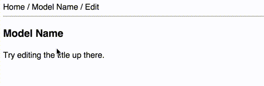

Ember 1.13 introduced [closure actions][closure-actions], a significant change in how components communicate with their context. This new approach makes it much easier to work with nested components, as it's now possible to directly link a target and a grandchild component together.

[closure-actions]: http://emberjs.com/blog/2015/06/12/ember-1-13-0-released.html#toc_closure-actions

But there's another new feature of closure actions that I haven't seen much written about, which is just as useful. Closure actions have return values.

This opens up a new kind of interaction between components, which makes it easier to divide responsibilities cleanly and logically. For me, this means reducing the number of two-way bindings, and simplifying my code.

## Normal Ember actions: strings all the way down

As a reminder, here's how actions have worked in Ember until now. You render a component in a template:

```handlebars
{{title-editor title=model.title onSave="saveModel"}}
```

This binds up the model's `title` attribute to the component's `title` attribute, and assigns a controller action called `saveModel` to the component's `onSave` attribute. Here's what the component might look like:

```javascript
export default Ember.Component.extend({
  title: null,

  actions: {
    save: {
      this.sendAction('onSave');
    }
  }
});
```

And the template:

```handlebars
{{input value=title}}
<button {{action "save"}}>Save</button>
```

When the user clicks the "Save" button, it fires the `save` action on the component. This in turn fires the action bound to `onSave` against the component's target. Since we bound the `onSave` attribute to `saveModel`, this means sending the `saveModel` action to the target, which is the controller.

As you can see, all of this is done using strings: the `onSave` attribute value is just a string, `saveModel`, which is sent up the chain until something handles it. This is fine, but we can do better.

## Closure actions: functions!

The new closure actions are similar. Here's the change in the controller's template:

```handlebars
{{title-editor title=model.title onSave=(action "saveModel")}}
```

Instead of binding the `onSave` attribute to a string, it's now bound to the result of the `(action)` helper. This returns a function instead, which means that we change how the component sends the action:

```javascript
export default Ember.Component.extend({
  title: null,

  actions: {
    save: {
      this.attrs.onSave();
    }
  }
});
```

We access the closure action through the component's `attrs` property. When we do so, it's a function, so we just call it like any other JavaScript function.

But how does this work? If it's just a normal JavaScript function, how is it communicating with the controller?

## Closures

This works because [the `(action)` helper you saw in the template creates a closure][action-helper], which is a function with captured context. When we call the function in the component, it uses that context to refer back to the controller directly.

[action-helper]: https://github.com/emberjs/ember.js/blob/eeb8ee905171483e47ace7786ffcf7e62d8ea985/packages/ember-routing-htmlbars/lib/keywords/closure-action.js#L69-L98

Doing this allows us to nest actions down through multiple controllers, without having to implement awkward chains of bubbling actions back up. But that's not what I want to write about here. I'm more interested in another property of JavaScript functions: they return a value.

## Returning values from actions

Normal actions are a strictly one-way communications mechanism. [`sendAction` doesn't return any value at all][send-action].

[send-action]: https://github.com/emberjs/ember.js/blob/915aa55c5ad977f6e930c36e8c6a26b2deb3dbd1/packages/ember-views/lib/components/component.js#L238-L259

Closure actions are called directly, so whatever value they return is available to you. This gives your components the option of collaborating with their target, just by calling a function and using its return value.

## Example: name editor component

A common pattern in Ember apps is for models to have a route and controller associated with them, with a template displaying the name of the model as its title. Often, users will want to edit the name of the model, and doing so inline is a neat piece of UI. Here's what that might look like:



A naive implementation of this is trivial: pass the entire model in to the component, and allow it to save or roll back when the user clicks on the save or cancel buttons. This gives the component a huge amount of responsibility, which I'd rather avoid.

So what if we just pass in the name attribute? Then we need a save action, and a cancel action, which our controller can implement however it needs. There's a problem though: saving will sometimes fail, because networks and servers are flaky. How do we cope with that?

To implement this neatly with a data down, actions up approach, we can make use of closure actions. Here's how I've done this, starting with the template in the application:

```handlebars
{{name-editor name=model.name onSave=(action "saveName")}}
```

This refers to an action called `saveName` on our controller. Here's how that looks:

```javascript
actions: {
  saveName(name) {
    let model = this.get('model');
    model.set('name', name);
    return model.save();
  }
}
```

You can see that this action includes a parameter, the new name of the model. And it also returns the result of `model.save()`, which since we're using Ember Data is a promise.

The `name-editor` component's code is mostly as you'd expect, but the interesting part is the save action handler:

```javascript
actions: {
  save() {
    this.attrs.onSave(this.get('editedName')).then(() => {
      this.set('editing', false);
    }).catch(error => {
      this.set('error', error);
    });
  }
}
```

Because our action handler returns a promise, we can use that to work out what to do next. If the promise resolves, we close the editor and go back to showing the name as normal. If it rejects, we display the error and stay in the editing state.

## Dividing responsibilities

This approach means that the component has a neat interface to its environment, and responsibilities are divided cleanly. The component can use a one-way binding for the name, and entirely handles the user interface state. The only requirements of the component target are to supply a name property, and implement a `save` action handler which returns a promise.

The component doesn't care how saving happens. It might be a promise which just resolves instantly, as we want to handle saving later. It might be a normal Ember Data save call. Or we might make a specific API call to patch in the new name without updating any other attributes.

## Final thoughts and links to code

This is a significant change in how actions work in Ember. Returning values from actions seems really useful, and it looks like it's going to make things simpler in some cases.

I've implemented this component as a demo of this approach. [It's on GitHub](https://github.com/alisdair/name-editor/). Here are direct links to some of the source files:

- [Component JavaScript](https://github.com/alisdair/name-editor/blob/master/app/components/name-editor.js)
- [Component template](https://github.com/alisdair/name-editor/blob/master/app/templates/components/name-editor.hbs)
- [Index controller](https://github.com/alisdair/name-editor/blob/master/app/controllers/index.js)
- [Index template](https://github.com/alisdair/name-editor/blob/master/app/templates/index.hbs)
- [Index route (with fake unreliable server to demo error handling)](https://github.com/alisdair/name-editor/blob/master/app/routes/index.js)
