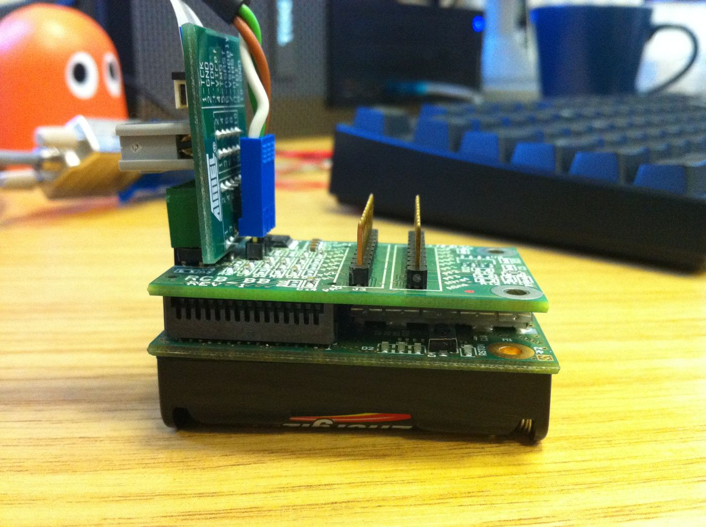
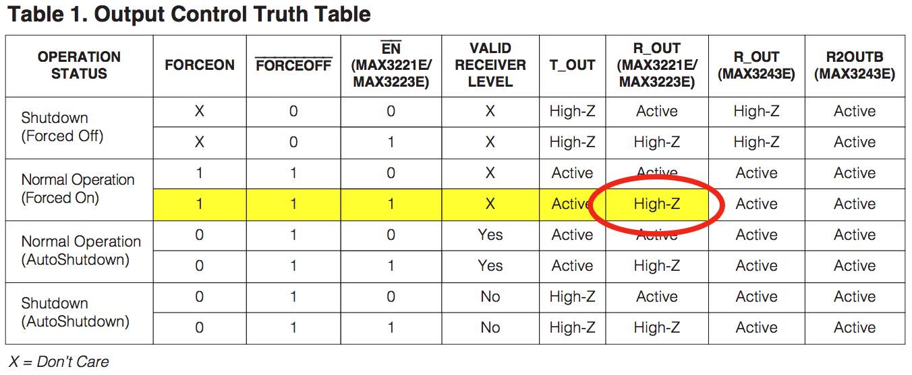

As part of [my awesome day job](http://www.embeddedtech.co.uk/), I am currently working with the [ATmega128RFA1 microcontroller](http://www.atmel.com/dyn/products/product_card.asp?part_id=4692). For development, I have a [Dresden Elektronik RCB](http://www.dresden-elektronik.de/shop/prod128.html?language=en) with the [RCB\_BB breakout board](http://www.dresden-elektronik.de/shop/prod85.html) to give me access to the UART and JTAG pins. It looks a lot like this:



This article describes how to make the UART work on this particular combination of hardware. For the impatient, [here's the code](https://gist.github.com/1339508):

```c
#include <stdint.h>
#include <avr/io.h>
#include <avr/interrupt.h>

#define BAUD 9600

uint8_t usart_recv()
{
    while (!(UCSR1A & (1 << RXC1)))
        ;
    return UDR1;
}

void usart_send(uint8_t b)
{
    while (!(UCSR1A & (1 << UDRE1)))
        ;
    UDR1 = b;
}

int main(void)
{
    cli();
    CLKPR = (1 << CLKPCE);
    CLKPR = (1 << CLKPS0);
    sei();

    UBRR1 = ((F_CPU/16)/BAUD) - 1;
    UCSR1B = (1 << RXEN1) | (1 << TXEN1);
    UCSR1C = (1 << UCSZ11) | (1 << UCSZ10) | (1 << USBS1);
    DDRD = (1 << PD7) | (1 << PD6) | (1 << PD4);
    PORTD = (1 << PD7) | (1 << PD6);

    while(1)
        usart_send(usart_recv());
}
```


## Know your clock speed

To have any chance at getting a serial port to work, you have to get the synchronisation to work. This requires knowing exactly what clock speed your micro is working with.

Of course, you can refer to the [ATmega128RFA1 data sheet](http://www.atmel.com/dyn/resources/prod_documents/doc8266.pdf) (page 149) to find out:

> The device is shipped with internal RC oscillator at 16.0 MHz, the 1:2 prescaler enabled 
and with the fuse CKDIV8 programmed, resulting in 1.0 MHz system clock.

This seems to be a mistake in the data sheet. If you [read the fuse settings](http://hackingwithgum.com/2009/11/05/dumping-avr-fuse-settings-in-bash/), you'll see agreement: internal RC oscillator selected, CKDIV8 set. However, page 155 of the data sheet describes what happens when CKDIV8 is set:

> Note that the factor is different when using the internal 16MHz RC oscillator as the clock source. The CKDIV8 Fuse determines the initial value of the CLKPS bits. If CKDIV8 is not programmed, the CLKPS bits will be reset to 0000. If CKDIV8 is programmed, CLKPS bits are reset to 0011 giving a division factor of 8 at start up.

So the default clock speed is actually 2MHz, not 1MHz. We want to run at 4MHz, so I disabled the CKDIV8 fuse and used the clock prescaler write procedure to divide the 16MHz RC oscillator by 4. Some LED flashing and a stopwatch confirmed that this was correct. Onward!


## Never trust sample code

The data sheet includes a section on controlling the USART, with sample code in C and assembler. This code will not work with the RCB128RFA1/RCB\_BB combination.

Most obviously, the data sheet code has some typos in it. You'll catch those quickly enough. Next, you'll notice that the UART exposed by the RCB\_BB is USART1, not USART0, so you need to make changes to all the registers for that.


## There are always more details

Then it still won't quite work. For me, this manifested as a broken receive pin: I could send data just fine, but the receive complete flag was never set.

An oscilloscope and a patient colleague tracked this down to the MAX3221E: the serial byte was getting to the RXIN pin, but RXOUT was dead. We speculated about a blown cap in the level conversion, considered going home, then looked at [the schematic for the RCB\_BB](http://www.dresden-elektronik.de/shop/media/products/0146110001236074032.pdf):


The level converter needs to be configured by the micro. Its FORCEON, <span style="text-decoration: overline">FORCEOFF</span>, and <span style="text-decoration: overline">ENABLE</span> pins are connected to GPIO pins on the board. These pins default to input (high impedance) state, which will register as logic 1 with the MAX3221E. This puts the chip into an undesirable state:



R\_OUT is left in high impedance state, so the microcontroller can't read from it, so we can't receive any data.


## Schematics are misleading

The obvious solution is to set pins PC7, PC6, and PC4 to output, then drive PC7 and PC6 to 1 and PC4 to 0:

```c
DDRC = (1 << PC7) | (1 << PC6) | (1 << PC4);
PORTC = (1 << PC7) | (1 << PC6);
```

This doesn't work. (Insert another hour of oscilloscope tracing and hair-pulling here, if you feel like it).

Just before accepting defeat, I traced through the schematics again: [RCB\_BB](http://www.dresden-elektronik.de/shop/media/products/0146110001236074032.pdf) says that the pins are PC7, PC6, and PC4; which are connected to EXT0 pins 28, 27, and 25; [RCB128RFA1](http://www.dresden-elektronik.de/shop/media/products/0831658001272549656.PDF) has EXT0 pins 28, 27, and 25 connected to… PD7, PD6, and PD4.

And therefore:

```c
DDRD = (1 << PD7) | (1 << PD6) | (1 << PD4);
PORTD = (1 << PD7) | (1 << PD6);
```

Success.

## Finally, it works

Hopefully anyone else who tries to use the UART will hit this page. It should be fairly simple to get my code to work: compile with avr-gcc, disable the CKDIV8 fuse on your micro with the programmer, then cross your fingers.

More detailed code with references and explanatory comments is in [RCG128RFA1 UART gist on github](https://gist.github.com/1339508). And remember: don't blindly trust data sheets. Not even once.
